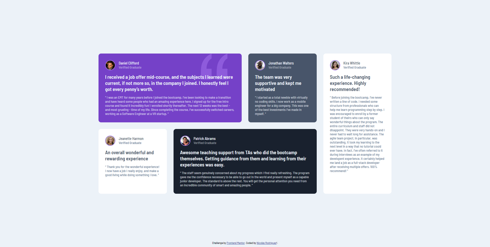

# Frontend Mentor - Testimonials grid section solution

Esta es la solución de [Testimonials grid section challenge on Frontend Mentor](https://www.frontendmentor.io/challenges/testimonials-grid-section-Nnw6J7Un7). Frontend Mentor ayuda a mejorar las habilidades de code mediante la realización de proyectos.

## Tabla de contenidos

- [Resumen](#Resumen)
  - [El desafio](#El-desafio)
  - [Screenshot](#screenshot)
  - [Links](#links)
- [Proceso](#Proceso)
  - [Construcción](#Construcción)
- [Sobre mi](#Sobre-mi)

## Resumen

### El desafio

Aplicar CSS Grid logrando una vista óptima sin importar el tamaño del dispositivo

### Screenshot

## Proceso

### Construcción

- Etiquetas semanticas de HTML5
- Flexbox
- CSS Grid
- Metodología Mobile-first 

## Sobre mi

- Connect with me - [Linkedin](https://www.linkedin.com/in/nirodriguez/)
- Frontend Mentor - [@nicolasrodriguez3](https://www.frontendmentor.io/profile/nicolasrodriguez3)

Gracias!
